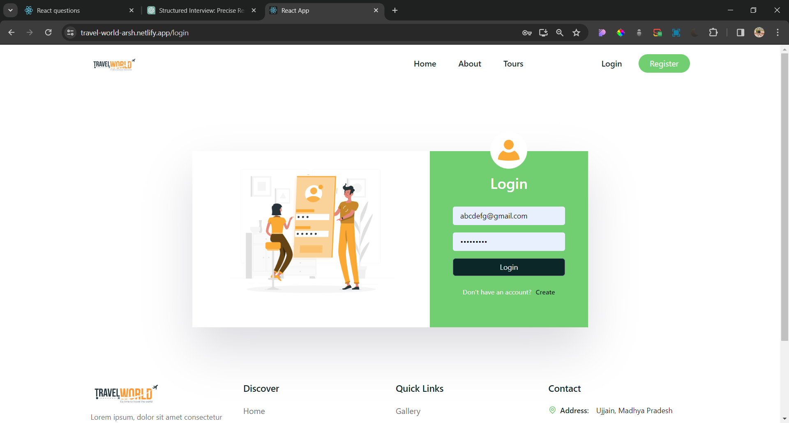

# Travel-World

It is a web application to book tours in multiple locations.Click on deployed link [Deployed Link](https://travel-world-arsh.netlify.app/)

## Table of Contents

- [Project Overview](#project-overview)

## Project Overview

### Key Features

- Login, Signup using jwt Authentication.
- Search Functionality using mongodb indexes.
- Reviews functionality on each tour.
- Fully responsive

### Technologies Used

- React.js, Express.js, NodeJs, MongoDB
- Redux
- Tailwind Css

### Screenshots/Demo

- Login Page

- Landing page

- Featured Tours

- Tour Booking

- Tour Booking done

- Responsive Design

